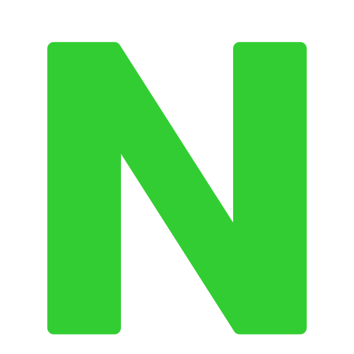
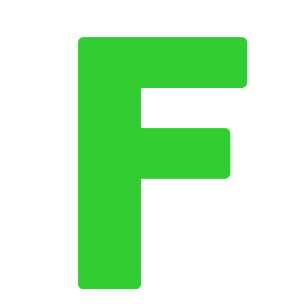
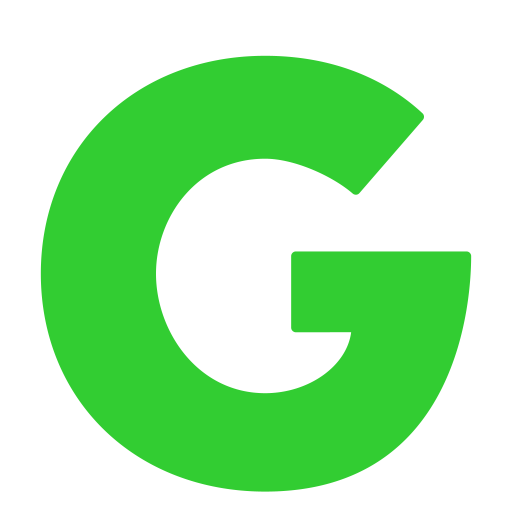

# <u style="font-style: italic; color: #D27D2D;">Learn HTML</u>

---

## About the Project Owner

- Name <u style="text-decoration-color: #32cd32;">Mohamed Sadawy Thabet</u> (M3MD69)
- Field <u style="text-decoration-color: #32cd32;">Software Engineer</u> / <u style="text-decoration-color: #32cd32;">Native Android Developer</u>
-  Accounts
    <ul>
        <li> Telegram Accounts</li>
        <ul>
            <li> Private <a style="color: limeGreen;" href="https://t.me/M4MD24">@M4MD24</a></li>
            <li> Nullexia For Programming <a style="color: limeGreen;" href="https://t.me/Nullexia">@Nullexia</a></li>
            <li> Software Consulting <a style="color: limeGreen;" href="https://t.me/SoftwareConsulting">@SoftwareConsulting</a></li>
        </ul>
        <li> Github <a style="color: limeGreen;" href="https://github.com/M4MD24">@M4MD24</a></li>
    </ul>

---

## About the Project Details

- **Recommended using** `WebStorm, Intellij IDEA (Community / Ultimate / EAP), Aqua`
- **Currently Used** `Aqua`
- **HTML Version** `HTML5`

---

## 1. [Learn](src/_1_learn)

- <u style="text-decoration-color: #D27D2D;">Learn Examples of Concepts</u>.

### 1. [Declaration (Prolog)](src/_1_learn/_1_1_declaration)

### 2. [Elements and Tags](src/_1_learn/_1_2_elements_and_tags)

### 3. [Comment](src/_1_learn/_1_3_comment)

### 4. [Attributes](src/_1_learn/_1_4_attributes)

### 5. [Nested Elements](src/_1_learn/_1_5_nested_elements)

### 6. [Self Closing Tags](src/_1_learn/_1_6_self_closing_tags)

### 7. [XSD (XML Schema Definition)](src/_1_learn/_1_7_xml_schema_definition)

### 8. [DTD (Document Type Definition)](src/_1_learn/_1_8_document_type_definition)

---

## Resources

### Learn

- Note: <u style="text-decoration-color: #D27D2D;">After learning from the sources, what was explained in the project is explained in my ways not copied mostly</u>.

#### Websites

<ul>
<li><a style="color: #D27D2D;" href="https://www.youtube.com">Youtube</a></li>
<li><a style="color: #D27D2D;" href="https://www.w3schools.com">W3Schools</a></li>
</ul>
